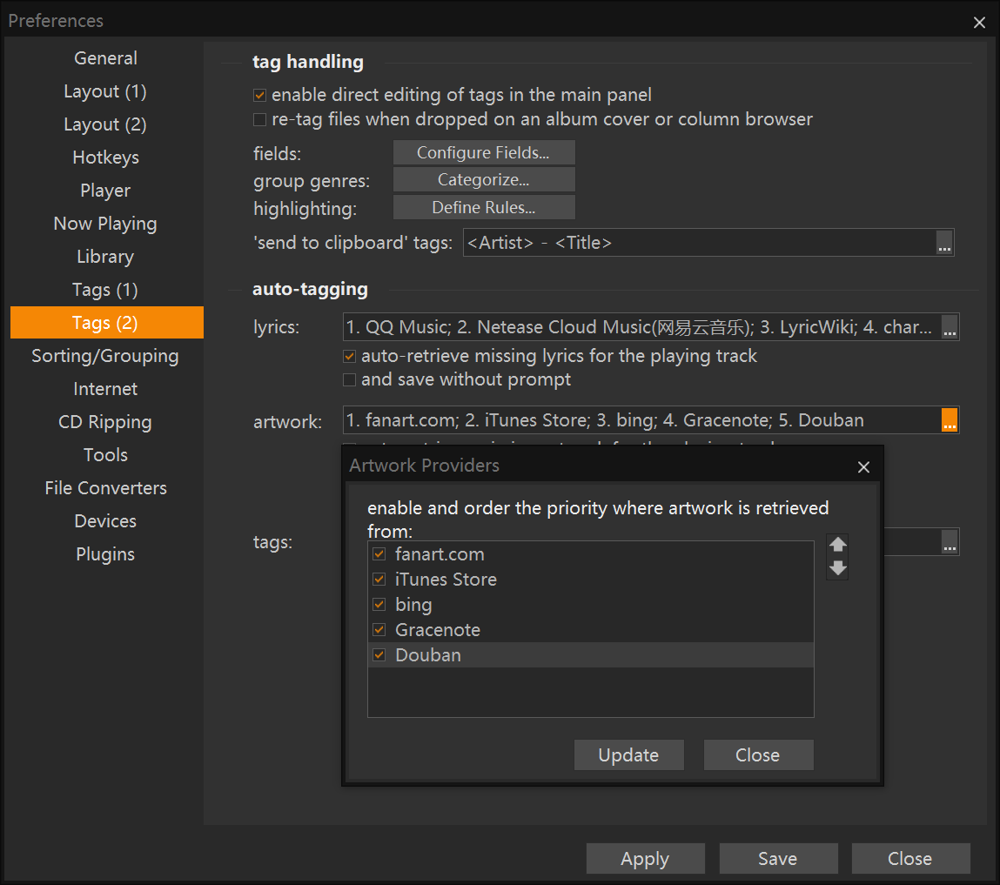

#### Readme
A Artwork Provider Plug-in for MusicBee. Each branch is a different provider.  
now it could search album cover from music.douban.com, music.163.com, y.qq.com, vgmdb.info.   
Also it is a template for a artwork provider plugin for MusicBee.

#### How to use
unzip the release files to the MusicBee\Plugins folder, then the preferences-tags(2)-artwork will shows new provider.

#### 说明
这是一个在线搜索专辑封面的MusicBee插件。不同分支是不同的网站来源。
目前包含了豆瓣音乐，网易云音乐，QQ音乐，Vgmdb四个不同的分支（插件）。

#### 使用
解压文件到MusicBee安装路径的Plugins文件夹， 重新打开MusicBee时，在编辑-首选项-标签(2)-封面可以看到新的插件，勾选并保存即可。

